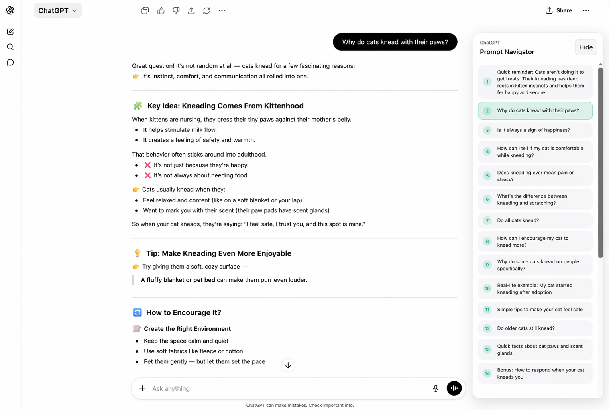

# ChatGPT Prompt Navigator

ChatGPT Prompt Navigator is a lightweight browser extension that adds a prompt sidebar to ChatGPT so long conversations are easier to scan and revisit.

## Screenshot



## Features

- Detects user prompts in the current conversation
- Builds a sidebar list of prompts as the page loads
- Scrolls to a selected turn when you click an item
- Highlights the prompt nearest to your current scroll position
- Remembers the sidebar collapsed state per conversation

## Browser Support

- Microsoft Edge
- Google Chrome
- Mozilla Firefox

## Installation

### Edge

1. Open `edge://extensions`
2. Enable `Developer mode`
3. Click `Load unpacked`
4. Select this folder: `chatgpt-prompt-navigator-edge`

### Chrome

1. Open `chrome://extensions`
2. Enable `Developer mode`
3. Click `Load unpacked`
4. Select this folder: `chatgpt-prompt-navigator-edge`

### Firefox

1. Open `about:debugging#/runtime/this-firefox`
2. Click `Load Temporary Add-on...`
3. Select the `manifest.json` file in this folder

Temporary Firefox installs are removed when Firefox restarts unless the extension is packaged and signed.

## Project Structure

```text
.
|- content.js
|- sidebar.css
|- manifest.json
|- docs/
`- icons/
```

## Development Notes

- The extension runs on `https://chatgpt.com/*` and `https://chat.openai.com/*`
- The current implementation is intentionally small and uses only a content script plus CSS
- No chat content is sent anywhere; the extension works entirely in the page
- The `icons/` folder is kept in the repo for future store packaging assets

## Roadmap Ideas

- Add packaged browser icons and store-ready metadata
- Support filtering or searching prompts within the sidebar
- Add export or copy helpers for prompt lists

## License

MIT
